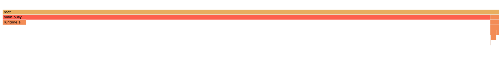

# pprof-experiment

## 概要

`net/pprof` 特にframegraphの見方について。
遅いselect処理はframegraphを見てもわからないという認識だったが、ちゃんと調べたことがなかったので実験してみました。

## 準備

* `busy()` CPUを使う処理
* `heavySelect()` 遅いselect処理

## 手順

 `main.go`を実行

profile実行 

```
curl http://localhost:6060/debug/pprof/profile\?seconds\=30 > pprof.pb.gz
```

確認
```
go tool pprof -http=":6061" pprof.pb.gz
```

## 結果



* `busy()`が支配的
* `heavySelect()`は出てこない

## まとめ

遅いクエリというだけでは、framegraphには出てこない。

クエリ結果が大量のレコードである場合など、結果的にCPUを使う処理の場合もある。

